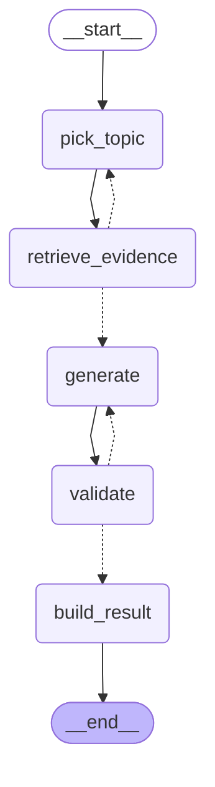

# Strategy

면접 질문의 방향·순서·난이도를 결정하고, 실제 질문 문장 생성을 담당하는 계층.

## 전체 구조
Interviewer
│
▼
StrategyAgent
├── StrategyState        (세션 전체 출제 이력)
├── CoverageMap          (Evidence가 제공하는 주제별 근거 커버리지)
├── difficulty.py        (다음 난이도 결정, 순수 함수)
├── graph.py              (메인 질문 생성 그래프, LangGraph)
├── question_gen.py       (파생 질문 5종 + hint LLM 생성)
└── personalization.py    (이전 면접 약점 주제 조회, Assessment stub)

## 메인 질문 생성 그래프 (graph.py)

메인 질문 하나를 생성하는 과정만 LangGraph로 구성했다. `next_question()`은 내부적으로 이 그래프를 `invoke()` 한 번 호출한다.

- `retrieve_evidence` → `pick_topic`: 근거가 부족하면 대체 주제로 재시도 (최대 3회, `_MAX_RETRY`)
- `validate` → `generate`: 검증 실패 시 재생성 (최대 1회, `_MAX_REGENERATE`)
- LLM은 `generate` 노드에서만 호출된다. 최악의 경우에도 LLM 호출은 최대 2회(최초 1회 + 재생성 1회)로 제한된다.

### 메인 질문만 그래프인 이유

파생 질문(follow_up/challenge/confirm_positive/confirm_negative/trap)과 hint는 그래프로 만들지 않고 `question_gen.py`에서 단일 LLM 호출로 처리한다.

이유:
- 파생 질문은 주제(topic)가 이미 메인 질문에서 정해져 있어 "주제를 다시 고르는" 분기가 필요 없다.
- 근거 부족 시 재시도할 대체 주제라는 개념 자체가 파생 질문에는 없다 (같은 topic 안에서 target만 다르게 검색할 뿐).
- 검증(validate) 단계도 재생성 루프도 두지 않았다. 파생 질문은 답변 흐름 중간에 빠르게 나가야 해서, 메인 질문만큼 무겁게 다룰 필요가 없다고 판단했다.
- 즉 메인 질문은 "대체 주제 탐색 + 재생성"이라는 분기/루프가 있어 그래프로 표현할 가치가 있지만, 파생 질문은 분기가 없어 그래프로 감싸면 오히려 불필요한 복잡도만 늘어난다.

## 주제 선택 규칙 (pick_topic)

| 순서 | 규칙 |
|---|---|
| 1 | 근거가 약한 주제(`weak_topics`, confidence < 0.4)는 후보에서 제외 |
| 2 | 아직 안 물은 주제(unasked)가 있으면 그 안에서만 선택 (confidence로 좁히지 않음) |
| 3 | 직전 주제와 연속되지 않게 회피 |
| 4 | 이전 면접에서 약점이었던 주제(`weak_history_topics`)가 있고 초반(메인 질문 3개 미만)이면 우선 배치 |
| 5 | 모든 주제를 다 물었으면(주제 소진) 전체 후보로 재순환, confidence 상위 3개 중 무작위 선택 |
| 6 | 근거가 있는 주제가 하나도 없으면(coverage 미주입 등) "FastAPI" 폴백 |

## 난이도 결정 규칙 (difficulty.py)

`next_difficulty(state, last_signal)`는 순수 함수로, LLM이나 외부 호출 없이 이력만 보고 판단한다.

| 우선순위 | 조건 | 결과 |
|---|---|---|
| 1 | 첫 질문(last_signal 없음) | EASY |
| 2 | 직전 신호가 MISCONCEPTION 또는 CONFIRM_NEGATIVE | 한 단계 하강 |
| 3 | 최근 2회 연속 EASY | 강제 상승 (쉬운 질문 편중 방지) |
| 4 | 메인 질문 5개 이상 진행됐는데 HARD가 한 번도 안 나옴 | HARD로 강제 상승 |
| 5 | 최근 2회 연속 SUFFICIENT | 한 단계 상승 |
| 6 | 그 외 | 직전 난이도 유지 |

난이도 이력(`asked_difficulties`)은 메인/파생 질문을 구분하지 않고 전체를 기준으로 판단한다. 사용자가 실제로 받는 질문 흐름 전체가 난이도 체감의 기준이라고 판단했기 때문이다.

파생 질문의 난이도는 kind별 고정값을 사용한다 (follow_up/confirm 계열 EASY, challenge/trap MEDIUM). 이는 잠정적 기본값이며, 향후 State 기반 정책으로 재검토할 수 있다.

## 파생 질문 프롬프트 입력

파생 질문 5종은 공통 헬퍼 `_generate_derived_question()`을 통해 생성되며, 다음 정보를 프롬프트에 반영한다.

| 입력 | 출처 | 역할 |
|---|---|---|
| `target` | `AnswerQualitySignal.next_probe_target` | 파고들 대상 |
| `answer_excerpt` | Interviewer가 transcript에서 발췌 | 답변 인용 |
| `rationale` | `AnswerQualitySignal.rationale` | 판단 근거 반영, 더 정확한 문제 지점을 겨냥하는 질문 생성에 사용 |

## 개인화 (personalization.py)

`get_weak_topics(user_id)`는 Assessment(D) 담당의 실제 구현 제공 전까지 항상 빈 리스트를 반환하는 stub이다. 이전 면접 이력이 없을 때와 동일하게 동작하므로, 별도 분기 없이 자연스럽게 "커버리지 기반 선택만" 동작한다.

## 개발용 스크립트

정식 코드가 아니라 눈으로 품질을 확인하기 위한 도구. 언더스코어(`_`) 접두사로 구분한다.

- `_simulate.py`: 메인 질문 10개를 실제로 생성해보고 주제 분포/난이도 분포/질문 텍스트를 출력
- `_measure_latency.py`: `next_question()` 1회 호출 소요 시간을 측정하고 음성 모드 허용선(3초) 초과 여부 확인
