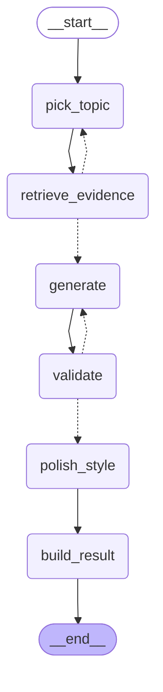

# Strategy

면접 질문의 방향·순서·난이도를 결정하고, 실제 질문 문장 생성을 담당하는 계층.

## 전체 구조
Interviewer
│
▼
StrategyAgent
├── StrategyState        (세션 전체 출제 이력)
├── CoverageMap          (Evidence가 제공하는 주제별 근거 커버리지)
├── difficulty.py        (다음 난이도 결정, 순수 함수)
├── graph.py              (메인 질문 생성 그래프, LangGraph)
├── question_gen.py       (파생 질문 5종 + hint LLM 생성)
└── personalization.py    (이전 면접 약점 주제 조회, Assessment stub)

Strategy는 자체 store를 갖지 않고, Evidence가 소유한 두 검색 경계(RAG)를 호출만 한다.
둘은 성격이 달라 나란히 두면 안 된다 — 하나는 사용자별, 하나는 전역이다.

| 검색 함수 | 소유 | 네임스페이스 | 호출 지점 |
|---|---|---|---|
| `evidence.retrieval.search_evidence` | Evidence(A) | `user_id`별 (개인 Notion/GitHub 근거) | `graph.py`의 `retrieve_evidence` 노드, `question_gen.py`의 `_generate_derived_question`/`generate_hint` — 질문 **내용**의 근거로 사용 |
| `evidence.question_patterns.search_interview_question_signals` | Evidence(A) | 없음(전역, 크롤링 기반 실전 질문 패턴) | `question_gen.py`의 `apply_pattern_style` — 완성된 질문 문장 자체를 쿼리로 던져 **화법·문장 구조**만 참고, 기술적 내용은 절대 가져오지 않음 |

`CoverageMap`도 evidence 쪽에서 만들어 Strategy에 주입되는 값이라(`pick_topic`이 읽기만 함), Strategy 코드 어디에도 evidence 원문을 직접 만지는 로직은 없다.

## 메인 질문 생성 그래프 (graph.py)

메인 질문 하나를 생성하는 과정만 LangGraph로 구성했다. `next_question()`은 내부적으로 이 그래프를 `invoke()` 한 번 호출한다.

- `retrieve_evidence` → `pick_topic`: 근거가 부족하면 대체 주제로 재시도 (최대 3회, `_MAX_RETRY`)
- `validate` → `generate`: 검증 실패 시 재생성 (최대 1회, `_MAX_REGENERATE`)
- `validate` 통과 후 `polish_style`: evidence 기반으로 완성된 질문 문장에, 전역 질문 패턴 스토어
  (`evidence.question_patterns.search_interview_question_signals`)에서 의미적으로 가장 가까운 실전
  질문을 찾아 화법·문장 구조만 입힌다. 쿼리는 topic이 아니라 완성된 질문 문장 자체 — 기술개념형/
  경험프레임형 어느 쪽이 더 비슷한지는 유사도가 자연히 정하므로 미리 kind를 필터링하지 않는다. 매칭
  실패/미스가 있어도 원본 문장을 그대로 쓰므로 이 단계가 실패해도 질문 생성 자체는 막히지 않는다.
  같은 로직(`question_gen.apply_pattern_style`)을 파생 질문(`_generate_derived_question`)에도 재사용한다.
- LLM은 `generate`/`polish_style` 노드에서 호출된다. 최악의 경우 LLM 호출은 최대 3회(생성 1회 + 재생성
  1회 + 스타일 폴리시 1회)로 제한된다.

### 메인 질문만 그래프인 이유

파생 질문(follow_up/challenge/confirm_positive/confirm_negative/trap)과 hint는 그래프로 만들지 않고 `question_gen.py`에서 단일 LLM 호출로 처리한다.

이유:
- 파생 질문은 주제(topic)가 이미 메인 질문에서 정해져 있어 "주제를 다시 고르는" 분기가 필요 없다.
- 근거 부족 시 재시도할 대체 주제라는 개념 자체가 파생 질문에는 없다 (같은 topic 안에서 target만 다르게 검색할 뿐).
- 검증(validate) 단계도 재생성 루프도 두지 않았다. 파생 질문은 답변 흐름 중간에 빠르게 나가야 해서, 메인 질문만큼 무겁게 다룰 필요가 없다고 판단했다.
- 즉 메인 질문은 "대체 주제 탐색 + 재생성"이라는 분기/루프가 있어 그래프로 표현할 가치가 있지만, 파생 질문은 분기가 없어 그래프로 감싸면 오히려 불필요한 복잡도만 늘어난다.

## 다음 메인 질문 프리페치 (agent.py)

`next_question()`은 매번 그래프를 처음부터 동기 호출하는 대신, 반환 직전에 **다음** 메인 질문 생성을
백그라운드 스레드(`ThreadPoolExecutor(max_workers=1)`)로 미리 시작해둔다. Interviewer 그래프는
질문을 낸 뒤 `wait_event`에서 지원자 응답을 기다리며 멈추므로(`interviewer/workflow/graph.py`), 그
유휴 시간 동안 다음 질문 생성을 끝내두는 구조다.

- **난이도 추정**: 다음 호출의 실제 `last_signal`은 아직 알 수 없지만, `next_difficulty()`의 규칙 중
  일부(연속 2회 EASY 강제 상승, N문항 이상인데 HARD 없음 강제 상승)는 `last_signal` 없이 `state`만으로
  이미 확정된다. `_guess_next_difficulty()`는 이 두 규칙에는 걸리지 않는 중립 quality로 `next_difficulty()`를
  그대로 호출해, 이 두 규칙은 정확히 맞히고 나머지(오개념 하강, 연속 2회 SUFFICIENT 상승처럼 실제 답변이
  나와야 아는 규칙)만 "직전 난이도 유지"로 추정한다.
- **소비 시점**: 다음 `next_question()` 호출에서 진짜 `last_signal`로 실제 난이도를 계산한 뒤 추정
  난이도와 비교한다.
  - 일치하면 프리페치 결과를 그대로 쓴다 (완료 전이면 `future.result()`로 대기 - 지금 새로 시작하는
    것보다 항상 빠르거나 같다).
  - 불일치하면 프리페치 결과는 버리고 기존처럼 동기 생성한다. 이 경우도 기존 대비 느려지지 않는다.
- **안전장치**: 백그라운드 스레드에는 `StrategyState`를 `model_copy(deep=True)`로 스냅샷을 떠서
  넘긴다 - 그 사이 파생 질문(`_record()`)이 메인 스레드에서 실제 state를 계속 바꿀 수 있기 때문이다.
  꺼내 쓰기 직전에는 `asked_question_texts`와의 중복 여부를 LLM 호출 없이 한 번 더 검사한다 - 프리페치
  시작 이후 늘어난 질문 이력은 프리페치 시점의 `validate()`가 미처 반영하지 못했을 수 있어서다.
- 첫 질문(`last_signal=None`)은 프리페치 대상이 아니라 항상 동기 생성이다.

## 주제 선택 규칙 (pick_topic)

| 순서 | 규칙 |
|---|---|
| 1 | 근거가 약한 주제(`weak_topics`, confidence < 0.4)는 후보에서 제외 |
| 2 | 아직 안 물은 주제(unasked)가 있으면 그 안에서만 선택 (confidence로 좁히지 않음) |
| 3 | 직전 주제와 연속되지 않게 회피 |
| 4 | 이전 면접에서 약점이었던 주제(`weak_history_topics`)가 있고 초반(메인 질문 3개 미만)이면 우선 배치 |
| 5 | 모든 주제를 다 물었으면(주제 소진) 전체 후보로 재순환, confidence 상위 3개 중 무작위 선택 |
| 6 | 근거가 있는 주제가 하나도 없으면(coverage 미주입 등) "FastAPI" 폴백 |

## 난이도 결정 규칙 (difficulty.py)

`next_difficulty(state, last_signal)`는 순수 함수로, LLM이나 외부 호출 없이 이력만 보고 판단한다.

| 우선순위 | 조건 | 결과 |
|---|---|---|
| 1 | 첫 질문(last_signal 없음) | EASY |
| 2 | 직전 신호가 MISCONCEPTION, CONFIRM_NEGATIVE 또는 UNKNOWN("모르겠다") | 한 단계 하강 |
| 3 | 최근 2회 연속 EASY | 강제 상승 (쉬운 질문 편중 방지) |
| 4 | 메인 질문 4개 이상 진행됐는데 HARD가 한 번도 안 나옴 | HARD로 강제 상승 |
| 5 | 최근 2회 연속 SUFFICIENT | 한 단계 상승 |
| 6 | 그 외 | 직전 난이도 유지 |

UNKNOWN도 MISCONCEPTION과 동일하게 즉시 하강 대상이다. 지원자가 "모르겠다"고 반복 답변해도
난이도가 한 번 오른 뒤 고정된 채 안 내려오는 문제가 있었는데(예: 규칙 4로 HARD까지 오른 뒤
계속 몰라서 넘어가도 하강 트리거가 없어 HARD가 유지됨), UNKNOWN을 규칙 2에 포함시켜 해결했다.

난이도 이력(`asked_difficulties`)은 메인/파생 질문을 구분하지 않고 전체를 기준으로 판단한다. 사용자가 실제로 받는 질문 흐름 전체가 난이도 체감의 기준이라고 판단했기 때문이다.

파생 질문의 난이도는 kind별 고정값을 사용한다 (follow_up/confirm 계열 EASY, challenge/trap MEDIUM). 이는 잠정적 기본값이며, 향후 State 기반 정책으로 재검토할 수 있다.

## 파생 질문 프롬프트 입력

파생 질문 5종은 공통 헬퍼 `_generate_derived_question()`을 통해 생성되며, 다음 정보를 프롬프트에 반영한다.

| 입력 | 출처 | 역할 |
|---|---|---|
| `target` | `AnswerQualitySignal.next_probe_target` | 파고들 대상 |
| `answer_excerpt` | Interviewer가 transcript에서 발췌 | 답변 인용 |
| `rationale` | `AnswerQualitySignal.rationale` | 판단 근거 반영, 더 정확한 문제 지점을 겨냥하는 질문 생성에 사용 |

## 개인화 (weak_history_topics)

이전 면접에서 약점으로 평가된 주제 목록은 `api/interviews/service.get_weak_topics(db, user_id)`(DB 조회)가 호출자 쪽(`api/sessions/router.py` → `facade.create_session`)에서 미리 조회해 `StrategyAgent(weak_history_topics=...)` 생성자로 전달한다. Strategy 패키지는 DB나 세션을 전혀 몰라도 되고, 받은 `list[str]`을 `self.weak_history_topics`에 저장해뒀다가 매 `next_question()` 호출 시 `QuestionGenState`에 그대로 넘긴다. 이전 이력이 없으면(신규 사용자 등) 빈 리스트가 전달되며, 이 경우 `pick_topic`의 4번 규칙은 자연스럽게 스킵되고 "커버리지 기반 선택만" 동작한다.

## 개발용 스크립트

정식 코드가 아니라 눈으로 품질을 확인하기 위한 도구. 언더스코어(`_`) 접두사로 구분한다.

- `_simulate.py`: 메인 질문 10개를 실제로 생성해보고 주제 분포/난이도 분포/질문 텍스트를 출력
- `_measure_latency.py`: `next_question()` 1회 호출 소요 시간을 측정하고 음성 모드 허용선(3초) 초과 여부 확인
